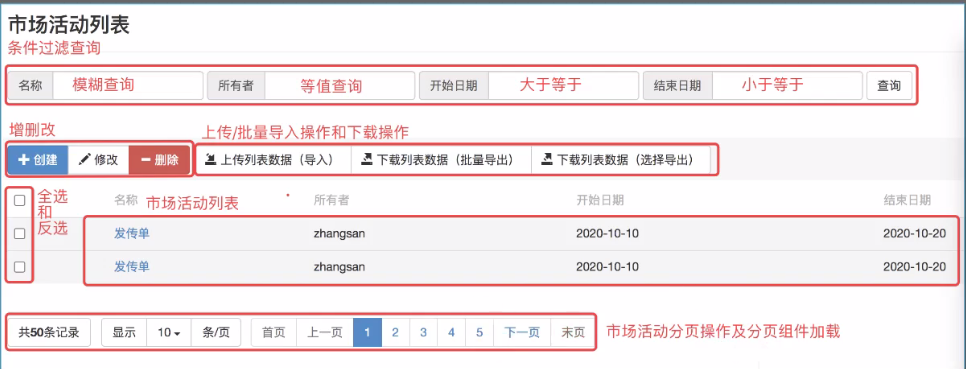

# Crm
## 系统设置/字典值
### 新增字典值
* 前端代码
```javascript
function getDictionaryTypeList() {

    $.ajax({
        url:"settings/dictionary/type/getDictionaryTypeList.do",
        data:{
        },
        type:"POST",
        dataType:"json",
        success:function(data) {
            //data:{code:0/1,msg:xxx,data:[{字典类型}...]}
            //异步加载字典类型编码数据
            if(data.code == 0){

                //定义字符串标签
                var html = "";

                //遍历返回值的集合
                $.each(data.data,function (i, n) {
                    //将页面加载的标签内容封装到字符串标签中
                    //将字符串标签的内容替换为动态数据
                    if(i == 0)
                        html += "<option></option>";

                    //通过双引号进行数据的嵌套
                    // html += "<option value='"+n.code+"'>"+n.name+"</option>";

                    //通过单引号进行数据的嵌套
                    html += '<option value="'+n.code+'">'+n.name+'</option>';

                })

                console.log("data",data.data);
                console.log("html",html);

                //将字符串标签加载到页面标签容器中
                $("#create-typeCode").html(html);

            }else{
                alert(data.msg);
            }
        }
    })
}

function saveDictionaryValue() {

    $("#saveDictionaryValueBtn").click(function () {

        //校验编码和字典值
        var typeCode = $("#create-typeCode").val();

        if(typeCode == ""){
            alert("请选择需要关联的字典类型编码...");
            return;
        }

        var value = $("#create-value").val();

        if(value == ""){
            alert("请输入字典值...");
            return;
        }

        var text = $("#create-text").val();

        var orderNo = $("#create-orderNo").val();

        //发送ajax请求进行新增操作
        $.ajax({
            url:"settings/dictionary/value/saveDictionaryValue.do",
            data:{
                "typeCode":typeCode,
                "value":value,
                "text":text,
                "orderNo":orderNo
            },
            type:"POST",
            dataType:"json",
            success:function(data) {
                //data:{code:0/1,msg:xxx}
                if(data.code == 0){
                    //新增成功,跳转到字典值首页面
                    window.location.href = "settings/dictionary/value/toIndex.do";
                }else{
                    alert(data.msg);
                }
            }
        })
    })
}
```

* 后台代码
```java
/**
 * 获取字典类型列表
 * @return
 */
@RequestMapping("/type/getDictionaryTypeList.do")
@ResponseBody
public Map<String,Object> getDictionaryTypeList() throws AjaxRequestException {

    List<DictionaryType> dictionaryTypeList = dictionaryService.findDictionaryTypeList();

    if(ObjectUtils.isEmpty(dictionaryTypeList))
        throw new AjaxRequestException("字典编码查询异常...");

    Map<String,Object> resultMap = new HashMap<>();
    resultMap.put("code",0);
    resultMap.put("msg","查询成功");
    resultMap.put("data",dictionaryTypeList);

    return resultMap;

}

/**
 * 新增字典值
 * @param dictionaryValue
 * @return
 */
@RequestMapping("/value/saveDictionaryValue.do")
@ResponseBody
public Map<String,Object> saveDictionaryValue(DictionaryValue dictionaryValue) throws AjaxRequestException {

    boolean flag = dictionaryService.saveDictionaryValue(dictionaryValue);

    if(!flag)
        throw new AjaxRequestException("新增失败...");

    Map<String,Object> resultMap = new HashMap<>();
    resultMap.put("code",0);
    resultMap.put("msg","新增成功...");
    return resultMap;

}
```

## 字典值-作业
* 字典值的修改操作
#### 前端
```aidl
function toValueEdit(){
    $("#toValueEditBtn").click(function (){
        //获取选中的复选框，只能选一个

        var cks=$("input[name=ck]:checked");
        if(cks.length!=1){
            //要么没有选中，要么选中多个
            alert("修改操作选中一条数据")
            return;
        }
        //选中一条数据
        var id=cks[0].value;

        if(id==""){
            alert("当前页面加载数据异常，请刷新后重试");
            return;
        }
        //发送传统请求

        window.location.href="settings/dictionary/value/toEdit.do?id="+id;
    })
}

function updateDictionaryValue() {
    //字典类型修改页面更新按钮绑定点击事件
    $("#updateDictionaryValueBtn").click(function (){
        //获取页面中的属性
        var typeCode=$("#value-typeCode").val();
        var value=$("#value-value").val();
        var text=$("#value-text").val();
        var orderNo=$("#value-orderNo").val();
        var id=$("#value-id").val();
        if(typeCode==""){
            $("#msg").html("当前数据加载异常，请刷新后重试");
            return;
        }
        //校验通过，情况提示信息
        $("#msg").html("");
        //发送ajax请求，进行更新操作
        $.ajax({
            url: "settings/dictionary/value/updateDictionaryValue.do",
            data: {
                "id":id,
                "typeCode":typeCode,
                "value":value,
                "text":text,
                "orderNo":orderNo
            },
            type: "POST",
            dataType: "json",
            success:function (data){
                //data:{code:0/1,msg:xxx}
                if(data.code==0){
                    //新增成功，跳转到字典类型首页面,查看更新信息
                    window.location.href="settings/dictionary/value/toIndex.do";
                }else {
                    //显示返回信息
                    $("#msg").html(data.msg);
                }

            }

        })


    })
}
```

#### 后端
```aidl
   //字典值更新跳转
    @RequestMapping("/value/toEdit.do")
    public String toValueEdit(String id,Model model) throws TraditionRequestException {
        //根据编码查询字典类型数据
        DictionaryValue dictionaryValue = dictionaryService.findDictionaryValueById(id);
        if (dictionaryValue==null){
            throw new TraditionRequestException("当前数据查询异常");
        }


        //封装到Model对象中
        model.addAttribute("dictionaryValue1",dictionaryValue);

        //跳转到修改页面
        return "/settings/dictionary/value/edit";
    }
    //进行value数据的更新，修改数据
    @RequestMapping("/value/updateDictionaryValue.do")
    @ResponseBody
    public Map<String,Object> updateDictionaryValue(DictionaryValue dictionaryValue) throws AjaxRequestException {
        //更新操作，以update方法名称开头
        boolean flag=dictionaryService.updateDictionaryValue(dictionaryValue);
        if(!flag){
            //修改失败
            throw new AjaxRequestException("修改字典值失败");

        }
        Map<String,Object> resultMap=new HashMap<>();
        resultMap.put("code",0);
        resultMap.put("msg","修改成功");
        return resultMap;

    }
```
#### SQL
```aidl
   <update id="updateDictionaryType">
        update tbl_dic_type set name=#{name},description=#{description}
        where code=#{code}
    </update>
```
* 字典值的删除操作
#### 前端
```aidl
function batchDeleteDictionaryValue(){
    $("#batchDeleteDictionaryValueBtn").click(function (){
        // alert("111")
        //获取勾选的复选框数量
        var count =$("input[name=ck]:checked");
        //遍历所有复选框
        //获取复选框中的value属性，拼接成参数
        //http://localhost:8080/crm/xxx?codes=xxx&codes=xxx
        var params="";
        for (var i=0;i<count.length;i++){
            params+="ids="+count[i].value;
            //拼接分隔符
            if(i<count.length-1){
                params+="&";
            }
        }
        // alert(params)
        if(confirm("您确定要删除这些数据吗？")){
            //发送ajax请求，进行批量删除操作
            $.ajax({
                url: "settings/dictionary/value/batchDeleteDictionaryValue.do?"+params,
                // url: "settings/dictionary/value/batchDeleteDictionaryValueCondition.do?"+params,
                data: {},
                type: "POST",
                dataType: "json",
                success:function (data){
                    //data:{code:0/1,msg:xxx}
                    if(data.code==0){
                        //删除成功，跳转到字典类型首页面,查看更新信息
//                        alert(data.msg)
                        window.location.href="settings/dictionary/value/toIndex.do";
                    }else {
                        //显示返回信息
//                        alert(data.msg);
                        //删除失败，跳转到字典类型首页面,查看信息
//                        window.location.href="settings/dictionary/value/toIndex.do";
                         $("#msg").html(data.msg);
                    }
                }
            })
        }
    })
}
```
#### 后端
```aidl
 @RequestMapping("/value/batchDeleteDictionaryValue.do")
    @ResponseBody
    public Map<String,Object> batchDeleteDictionaryValue(String[] ids) throws AjaxRequestException {
        boolean flag=dictionaryService.batchDeleteDictionaryValue(ids);
        if(!flag){
            throw new AjaxRequestException("删除失败");
        }
        Map<String,Object> resultMap=new HashMap<>();
        resultMap.put("code",0);
        resultMap.put("msg","删除成功");
        return resultMap;

    }
```
#### SQL
```aidl
  <delete id="deletelistByids">
        delete from tbl_dic_value where id in
        <foreach collection="array" item="c" separator="," open="(" close=")">
            #{c}
        </foreach>
    </delete>
```
## 模块介绍
* 工作台模块
    * 市场活动模块
    * 线索模块
    * 交易模块
    * 图表模块

## 工作台/市场活动
### 表关系介绍
* tbl_activity `市场活动表`
    * id            `唯一标识`
    * owner         `外键,用户表id`
    * name          `市场活动名称`
    * startDate     `开始时间`
    * endDate       `结束时间`
    * cost          `成本`
    * description   `描述`
    * createTime    `创建时间`
    * createBy      `创建人`
    * editTime      `修改时间`
    * editBy        `修改人`
    * isDelete      `逻辑删除,0代表未删除,1代表已删除`

* tbl_user `用户表`
    * id
    * ...

* tbl_activity_remark `市场活动备注信息表`
    * activityId    `外键,市场活动表id`
    * ...

* tbl_clue_activity_relation `线索和市场活动的中间关系表`
    * id            `唯一标识`
    * clueId        `线索id`
    * activityId    `市场活动id`
* tbl_clue `线索表`
    * id
    * ...

* tbl_contacts_activity_relation `联系人和市场活动的中间关系表`
    * id
    * contactsId    `联系人id`
    * activityId    `市场活动id`
* tbl_contacts `联系人表`
    * id
    * ...

### 市场活动功能介绍
* 公司想要进行推广业务,需要举办一些地推的活动,可以在市场活动中进行申请
* 由于市场活动上标识了创建时间和创建人,开始时间和结束时间,还有这场活动所需成本

### 跳转到市场活动页面
* 前端代码 `/workbench/index.jsp`
```html
<li class="liClass"><a href="workbench/activity/toIndex.do" target="workareaFrame"><span class="glyphicon glyphicon-play-circle"></span> 市场活动</a></li>
```

* 后台代码
```java
@Controller
@RequestMapping("/workbench/activity")
public class ActivityController {

    /**
     * 跳转到市场活动的首页面
     * @return
     */
    @RequestMapping("/toIndex.do")
    public String toIndex(){
        return "/workbench/activity/index";
    }
}
```

### 市场活动内容介绍


### 加载市场活动列表数据
* 前端代码
```javascript
function getActivityList() {

    $.ajax({
        url:"workbench/activity/getActivityList.do",
        data:{

        },
        type:"POST",
        dataType:"json",
        success:function(data) {
            //data:{code:0/1,msg:xxx,data:[{市场活动}]}
            if(data.code == 0){
                //查询成功,异步加载
                var html = "";

                $.each(data.data,function (i, n) {
                    html += '<tr class="'+(i%2==0?'active':'')+'">';
                    html += '<td><input type="checkbox" /></td>';
                    html += '<td><a style="text-decoration: none; cursor: pointer;" onclick="window.location.href=\'detail.jsp\';">'+n.name+'</a></td>';
                    html += '<td>'+n.owner+'</td>';
                    html += '<td>'+n.startDate+'</td>';
                    html += '<td>'+n.endDate+'</td>';
                    html += '</tr>';
                })

                $("#activityListBody").html(html);

            }else{
                alert(data.msg);
            }
        }
    })
}
```

* 后台代码
```java
/**
 * 查询市场活动列表
 * @return
 */
@RequestMapping("/getActivityList.do")
@ResponseBody
public Map<String,Object> getActivityList() throws AjaxRequestException {

    //查询市场活动列表
    List<Activity> activityList = activityService.getActivityList();

    //当前列表无数据
    if(ObjectUtils.isEmpty(activityList))
        throw new AjaxRequestException("当前市场活动无数据...");

    //查询成功
    Map<String,Object> resultMap = new HashMap<>();
    resultMap.put("code",0);
    resultMap.put("msg","查询成功...");
    resultMap.put("data",activityList);
    return resultMap;
}
```

* Sql
```xml
<!--List<Activity> findAll();-->
<select id="findAll" resultType="com.bjpowernode.crm.workbench.domain.Activity">
    select
    a.id,
    u.name as owner,
    a.name,
    a.startDate,
    a.endDate,
    a.cost,
    a.description,
    a.createTime,
    a.createBy,
    a.editTime,
    a.editBy,
    a.isDelete
    from tbl_activity a,tbl_user u
    where a.owner = u.id
</select>
```

### 封装公共的返回值结果集
```java
/**
 * 公共的返回值结果集
 */
public class R extends HashMap {
    
    public static R ok(){
        R r = new R();
        r.put("code",0);
        r.put("msg","操作成功...");
        return r;
    }

    public static R ok(Integer code){
        R r = new R();
        r.put("code",code);
        r.put("msg","操作成功...");
        return r;
    }

    public static R ok(String msg){
        R r = new R();
        r.put("code",0);
        r.put("msg",msg);
        return r;
    }

    public static R ok(Integer code,String msg){
        R r = new R();
        r.put("code",code);
        r.put("msg",msg);
        return r;
    }

    public static <T> R ok(Integer code,String msg,T data){
        R r = new R();
        r.put("code",code);
        r.put("msg",msg);
        r.put("data",data);
        return r;
    }

    public static R ok(Map map){
        R r = new R();
        r.put("code",0);
        r.put("msg","操作成功...");
        r.putAll(map);
        return r;
    }
    

    public static R err(){
        R r = new R();
        r.put("code",1);
        r.put("msg","操作失败...");
        return r;
    }

    public static R err(Integer code){
        R r = new R();
        r.put("code",code);
        r.put("msg","操作失败...");
        return r;
    }

    public static R err(Integer code,String msg){
        R r = new R();
        r.put("code",code);
        r.put("msg",msg);
        return r;
    }
}
```

### 分页查询
* 前端代码
```javascript
/**
 * 分页查询
 * @param pageNo        当前页
 * @param pageSize      每页条数
 */
function getActivityListByPage(pageNo, pageSize) {
    $.ajax({
        url:"workbench/activity/getActivityListByPage.do",
        data:{
            "pageNo":pageNo,
            "pageSize":pageSize
        },
        type:"POST",
        dataType:"json",
        success:function(data) {
            //data:{code:0/1,msg:xxx,data:[{市场活动}]}
            if(data.code == 0){
                //查询成功,异步加载
                var html = "";

                $.each(data.data,function (i, n) {
                    html += '<tr class="'+(i%2==0?'active':'')+'">';
                    html += '<td><input type="checkbox" name="ck"/></td>';
                    html += '<td><a style="text-decoration: none; cursor: pointer;" onclick="window.location.href=\'detail.jsp\';">'+n.name+'</a></td>';
                    html += '<td>'+n.owner+'</td>';
                    html += '<td>'+n.startDate+'</td>';
                    html += '<td>'+n.endDate+'</td>';
                    html += '</tr>';
                })

                $("#activityListBody").html(html);

            }else{
                alert(data.msg);
            }
        }
    })
}
```

* 后台代码
```java
    /**
     * 获取市场活动列表数据-分页查询
     * @return
     * @throws AjaxRequestException
     */
    @RequestMapping("/getActivityListByPage.do")
    @ResponseBody
    public R getActivityListByPage(Integer pageNo,Integer pageSize) throws AjaxRequestException {

        //根据当前页,计算出查询的索引值位置
        int pageNoIndex = (pageNo-1)*pageSize;

        //查询市场活动列表
        List<Activity> activityList = activityService.getActivityListByPage(pageNoIndex,pageSize);

        //当前列表无数据
        if(ObjectUtils.isEmpty(activityList))
            throw new AjaxRequestException("当前市场活动无数据...");

        //查询成功
        return R.ok(0,"查询成功...",activityList);
    }
```

* Sql
```xml
<!--
List<Activity> findAllByPage(@Param("pageNo") int pageNoIndex,
                             @Param("pageSize") Integer pageSize);
-->
<select id="findAllByPage" resultType="com.bjpowernode.crm.workbench.domain.Activity">
    select
    a.id,
    u.name as owner,
    a.name,
    a.startDate,
    a.endDate,
    a.cost,
    a.description,
    a.createTime,
    a.createBy,
    a.editTime,
    a.editBy,
    a.isDelete
    from tbl_activity a,tbl_user u
    where a.owner = u.id
    limit #{pageNo},#{pageSize}
</select>
```

### 全选和反选
```javascript
function selectActivityAll() {
    $("#selectActivityAllBtn").click(function () {
        $("input[name=ck]").prop("checked",this.checked);
    })
}


function reverseActivityAll() {
    $("#activityListBody").on("click","input[name=ck]",function () {
        $("#selectActivityAllBtn").prop(
            "checked",
            $("input[name=ck]").length == $("input[name=ck]:checked").length)
    });
}
```

### 封装公共的分页返回值结果集
```java
/**
 * 封装公共的分页的返回值结果集
 * @param <T>
 */
//将当前实体类的get/set/toString...方法默认实现
@Data
//可以通过链式变成的方式进行封装实体类
@Accessors(chain = true)
public class RPage<T> implements Serializable {

    private int code;
    private String msg;
    private int pageNo;//当前页
    private int pageSize;//每页条数
    private int maxRowsPerPage;//每页最多显示的记录数,20
    private int visiblePageLinks;//显示几个卡片,3
    private long totalPages;//总页数
    private long totalCounts;//总记录数
    private T data;//返回页面的数据,分页的数据

}
```

### 加载分页组件实现分页
* 前端代码
```javascript
/**
 * 分页查询 + 分页组件加载
 * @param pageNo
 * @param pageSize
 */
function getActivityListByPageComponent(pageNo,pageSize) {
    $.ajax({
        url:"workbench/activity/getActivityListByPageComponent.do",
        data:{
            "pageNo":pageNo,
            "pageSize":pageSize
        },
        type:"POST",
        dataType:"json",
        success:function(data) {
            //未加载分页组件:
            //data:{code:0/1,msg:xxx,data:[{市场活动}]}
            //加载分页组件:
            //data:{pageNo:xxx,pageSize:xxx,data:[{市场活动}...]...}
            if(data.code == 0){
                //查询成功,异步加载
                var html = "";

                $.each(data.data,function (i, n) {
                    html += '<tr class="'+(i%2==0?'active':'')+'">';
                    html += '<td><input type="checkbox" name="ck"/></td>';
                    html += '<td><a style="text-decoration: none; cursor: pointer;" onclick="window.location.href=\'detail.jsp\';">'+n.name+'</a></td>';
                    html += '<td>'+n.owner+'</td>';
                    html += '<td>'+n.startDate+'</td>';
                    html += '<td>'+n.endDate+'</td>';
                    html += '</tr>';
                })

                $("#activityListBody").html(html);

                //当异步数据加载完成后,初始化页面的分页组件
                $("#activityPage").bs_pagination({
                    currentPage: data.pageNo, // 页码
                    rowsPerPage: data.pageSize, // 每页显示的记录条数
                    maxRowsPerPage: data.maxRowsPerPage, // 每页最多显示的记录条数
                    totalPages: data.totalPages, // 总页数
                    totalRows: data.totalCounts, // 总记录条数

                    visiblePageLinks: data.visiblePageLinks, // 显示几个卡片

                    showGoToPage: true,
                    showRowsPerPage: true,
                    showRowsInfo: true,
                    showRowsDefaultInfo: true,

                    //当在组件中点击了,分页按钮或页码的按钮或跳转到第几页,都会执行下面的回调方法
                    onChangePage : function(event, data){
                        //回调自己的分页加载组件的方法
                        getActivityListByPageComponent(data.currentPage , data.rowsPerPage);
                    }
                });
            }else{
                alert(data.msg);
            }
        }
    })
}
```

* 后台代码
```java
/**
 * 获取市场活动列表数据-分页查询-加载前端分页组件
 * @return
 * @throws AjaxRequestException
 */
@RequestMapping("/getActivityListByPageComponent.do")
@ResponseBody
public RPage<List<Activity>> getActivityListByPageComponent(Integer pageNo, Integer pageSize) throws AjaxRequestException {

    //根据当前页,计算出查询的索引值位置
    int pageNoIndex = (pageNo-1)*pageSize;

    //查询市场活动列表
    List<Activity> activityList = activityService.getActivityListByPage(pageNoIndex,pageSize);

    //当前列表无数据
    if(ObjectUtils.isEmpty(activityList))
        throw new AjaxRequestException("当前市场活动无数据...");

    //查询当前市场活动的列表的总记录数
    long totalCounts = activityService.findActivityTotalCount();

    //计算出总页数
    long totalPages = totalCounts % pageSize == 0 ? totalCounts / pageSize : (totalCounts / pageSize) + 1;

    //查询成功
    return new RPage<List<Activity>>()
            .setCode(0)
            .setMsg("查询成功")
            .setData(activityList)
            .setPageNo(pageNo)
            .setPageSize(pageSize)
            .setMaxRowsPerPage(20)
            .setVisiblePageLinks(3)
            .setTotalCounts(totalCounts)
            .setTotalPages(totalPages);
}
```

### 条件过滤查询
* 前端代码
```javascript
/**
 * 分页查询 + 分页组件加载 + 条件过滤查询
 * @param pageNo
 * @param pageSize
 */
function getActivityListByPageComponentCondition(pageNo,pageSize) {

    //获取条件过滤查询的属性
    var activityName = $("#search-name").val();
    var username = $("#search-owner").val();
    var startDate = $("#search-startDate").val();
    var endDate = $("#search-endDate").val();

    $.ajax({
        url:"workbench/activity/getActivityListByPageComponentCondition.do",
        data:{
            "pageNo":pageNo,
            "pageSize":pageSize,
            "activityName":activityName,
            "username":username,
            "startDate":startDate,
            "endDate":endDate
        },
        type:"POST",
        dataType:"json",
        success:function(data) {
            //未加载分页组件:
            //data:{code:0/1,msg:xxx,data:[{市场活动}]}
            //加载分页组件:
            //data:{pageNo:xxx,pageSize:xxx,data:[{市场活动}...]...}
            if(data.code == 0){
                //查询成功,异步加载
                var html = "";

                $.each(data.data,function (i, n) {
                    html += '<tr class="'+(i%2==0?'active':'')+'">';
                    html += '<td><input type="checkbox" name="ck"/></td>';
                    html += '<td><a style="text-decoration: none; cursor: pointer;" onclick="window.location.href=\'detail.jsp\';">'+n.name+'</a></td>';
                    html += '<td>'+n.owner+'</td>';
                    html += '<td>'+n.startDate+'</td>';
                    html += '<td>'+n.endDate+'</td>';
                    html += '</tr>';
                })

                $("#activityListBody").html(html);

                //当异步数据加载完成后,初始化页面的分页组件
                $("#activityPage").bs_pagination({
                    currentPage: data.pageNo, // 页码
                    rowsPerPage: data.pageSize, // 每页显示的记录条数
                    maxRowsPerPage: data.maxRowsPerPage, // 每页最多显示的记录条数
                    totalPages: data.totalPages, // 总页数
                    totalRows: data.totalCounts, // 总记录条数

                    visiblePageLinks: data.visiblePageLinks, // 显示几个卡片

                    showGoToPage: true,
                    showRowsPerPage: true,
                    showRowsInfo: true,
                    showRowsDefaultInfo: true,

                    //当在组件中点击了,分页按钮或页码的按钮或跳转到第几页,都会执行下面的回调方法
                    onChangePage : function(event, data){
                        //回调自己的分页加载组件的方法
                        getActivityListByPageComponentCondition(data.currentPage , data.rowsPerPage);
                    }
                });
            }else{
                alert(data.msg);
            }
        }
    })
}
```

* 后台代码
```java
/**
 * 获取市场活动列表数据-分页查询-加载前端分页组件-条件过滤查询
 * @param pageNo
 * @param pageSize
 * 以下四个参数,是有可能传递为空的,所以我们在mybatis映射配置文件中
 *      进行动态sql的判断处理,如果不为空,则拼接sql,如果为空,则不拼接
 * @param activityName  市场活动名称,模糊查询
 * @param username      用户名称,等值查询
 * @param startDate     开始时间,查询大于等于开始时间的市场活动
 * @param endDate       结束时间,查询小于等于结束时间的市场活动
 * @return
 * @throws AjaxRequestException
 */
@RequestMapping("/getActivityListByPageComponentCondition.do")
@ResponseBody
public RPage<List<Activity>> getActivityListByPageComponentCondition(Integer pageNo,
                                                                     Integer pageSize,
                                                                     String  activityName,
                                                                     String  username,
                                                                     String  startDate,
                                                                     String  endDate) throws AjaxRequestException {

    //根据当前页,计算出查询的索引值位置
    int pageNoIndex = (pageNo-1)*pageSize;

    //查询市场活动列表-条件过滤查询
    List<Activity> activityList = activityService.getActivityListByPageCondition(
            pageNoIndex,
            pageSize,
            activityName,
            username,
            startDate,
            endDate);

    //当前列表无数据
    if(ObjectUtils.isEmpty(activityList))
        throw new AjaxRequestException("当前市场活动无数据...");

    //查询当前市场活动的列表的总记录数
    long totalCounts = activityService.findActivityTotalCountCondition(
            activityName,
            username,
            startDate,
            endDate
    );

    //计算出总页数
    long totalPages = totalCounts % pageSize == 0 ? totalCounts / pageSize : (totalCounts / pageSize) + 1;

    //查询成功
    return new RPage<List<Activity>>()
            .setCode(0)
            .setMsg("查询成功")
            .setData(activityList)
            .setPageNo(pageNo)
            .setPageSize(pageSize)
            .setMaxRowsPerPage(20)
            .setVisiblePageLinks(3)
            .setTotalCounts(totalCounts)
            .setTotalPages(totalPages);
}
```

* Sql
```xml
<!--
    List<Activity> findAllByPageCondition(@Param("pageNo") int pageNoIndex,
                                          @Param("pageSize") Integer pageSize,
                                          @Param("name") String activityName,
                                          @Param("username") String username,
                                          @Param("startDate") String startDate,
                                          @Param("endDate") String endDate);
-->
<select id="findAllByPageCondition" resultType="com.bjpowernode.crm.workbench.domain.Activity">
    select
    a.id,
    u.name as owner,
    a.name,
    a.startDate,
    a.endDate,
    a.cost,
    a.description,
    a.createTime,
    a.createBy,
    a.editTime,
    a.editBy,
    a.isDelete
    from tbl_activity a,tbl_user u
    <where>
        a.owner = u.id

        <if test="name!=null and name!=''">
            and a.name like '%' #{name} '%'
        </if>

        <if test="username!=null and username!=''">
            and u.name = #{username}
        </if>

        <if test="startDate!=null and startDate!=''">
            and a.startDate &gt;= #{startDate}
        </if>

        <if test="endDate!=null and endDate!=''">
            and a.endDate &lt;= #{endDate}
        </if>
    </where>
    limit #{pageNo},#{pageSize}
</select>

<!--
    long findTotalCountsCondition(@Param("name") String activityName,
                                  @Param("username") String username,
                                  @Param("startDate") String startDate,
                                  @Param("endDate") String endDate);
-->
<select id="findTotalCountsCondition" resultType="java.lang.Long">
    select
    count(*)
    from tbl_activity a,tbl_user u
    <where>
        a.owner = u.id

        <if test="name!=null and name!=''">
            and a.name like '%' #{name} '%'
        </if>

        <if test="username!=null and username!=''">
            and u.name = #{username}
        </if>

        <if test="startDate!=null and startDate!=''">
            and a.startDate &gt;= #{startDate}
        </if>

        <if test="endDate!=null and endDate!=''">
            and a.endDate &lt;= #{endDate}
        </if>
    </where>
</select>
```

### 条件过滤查询优化-前端代码
```javascript
function searchActivityCondition() {

    //点击查询按钮
    $("#searchActivityBtn").click(function () {
        
        //将查询的条件,封装到隐藏域中
        var name = $("#search-name").val();
        var owner = $("#search-owner").val();
        var startDate = $("#search-startDate").val();
        var endDate = $("#search-endDate").val();
        
        $("#hidden-name").val(name);
        $("#hidden-owner").val(owner);
        $("#hidden-startDate").val(startDate);
        $("#hidden-endDate").val(endDate);

        //获取查询的条件,可以将它封装到分页查询的方法中
        //可以直接调用分页查询方法即可
        getActivityListByPageComponentCondition(1,2);

    })
}


/**
 * 分页查询 + 分页组件加载 + 条件过滤查询
 * @param pageNo
 * @param pageSize
 */
function getActivityListByPageComponentCondition(pageNo,pageSize) {

    //获取条件过滤查询的属性
    //var activityName = $("#search-name").val();
    //var username = $("#search-owner").val();
    //var startDate = $("#search-startDate").val();
    //var endDate = $("#search-endDate").val();
    
    //隐藏域中获取条件过滤查询的数据
    var activityName = $("#hidden-name").val();
    var username = $("#hidden-owner").val();
    var startDate = $("#hidden-startDate").val();
    var endDate = $("#hidden-endDate").val();

    $.ajax({
        url:"workbench/activity/getActivityListByPageComponentCondition.do",
        data:{
            "pageNo":pageNo,
            "pageSize":pageSize,
            "activityName":activityName,
            "username":username,
            "startDate":startDate,
            "endDate":endDate
        },
        type:"POST",
        dataType:"json",
        success:function(data) {
            //未加载分页组件:
            //data:{code:0/1,msg:xxx,data:[{市场活动}]}
            //加载分页组件:
            //data:{pageNo:xxx,pageSize:xxx,data:[{市场活动}...]...}
            if(data.code == 0){
                //查询成功,异步加载
                var html = "";

                $.each(data.data,function (i, n) {
                    html += '<tr class="'+(i%2==0?'active':'')+'">';
                    html += '<td><input type="checkbox" name="ck"/></td>';
                    html += '<td><a style="text-decoration: none; cursor: pointer;" onclick="window.location.href=\'detail.jsp\';">'+n.name+'</a></td>';
                    html += '<td>'+n.owner+'</td>';
                    html += '<td>'+n.startDate+'</td>';
                    html += '<td>'+n.endDate+'</td>';
                    html += '</tr>';
                })

                $("#activityListBody").html(html);

                //当异步数据加载完成后,初始化页面的分页组件
                $("#activityPage").bs_pagination({
                    currentPage: data.pageNo, // 页码
                    rowsPerPage: data.pageSize, // 每页显示的记录条数
                    maxRowsPerPage: data.maxRowsPerPage, // 每页最多显示的记录条数
                    totalPages: data.totalPages, // 总页数
                    totalRows: data.totalCounts, // 总记录条数

                    visiblePageLinks: data.visiblePageLinks, // 显示几个卡片

                    showGoToPage: true,
                    showRowsPerPage: true,
                    showRowsInfo: true,
                    showRowsDefaultInfo: true,

                    //当在组件中点击了,分页按钮或页码的按钮或跳转到第几页,都会执行下面的回调方法
                    onChangePage : function(event, data){
                        //回调自己的分页加载组件的方法
                        getActivityListByPageComponentCondition(data.currentPage , data.rowsPerPage);
                    }
                });
            }else{
                alert(data.msg);
            }
        }
    })
}
```

### 新增市场活动
* 前端代码
```javascript
function openCreateActivityModal() {

    $("#openCreateActivityModalBtn").click(function () {
        //点击创建按钮,加载所有者下拉列表数据,打开模态窗口操作
        $.ajax({
            url:"settings/user/getUserList.do",
            data:{

            },
            type:"POST",
            dataType:"json",
            success:function(data) {
                //data:{code:0/1,msg:xxx,data:[{用户}...]}
                if(data.code == 0){
                    //异步加载,所有者下拉列表数据
                    var html = "";

                    $.each(data.data,function (i, n) {
                        html += "<option value='"+n.id+"'>"+n.name+"</option>";
                    })

                    $("#create-owner").html(html);

                    //设置默认选中当前登录的用户
                    $("#create-owner").val($("#userId").val());

                    //打开模态窗口
                    //页面定义打开模态窗口: data-toggle="modal" data-target="#createActivityModal"
                    //页面定义关闭模态窗口: data-dismiss="modal"
                    //js代码打开模态窗口:
                    $("#createActivityModal").modal("show");
                    //js代码关闭模态窗口:
                    //$("#createActivityModal").modal("hide");

                }
            }
        })
    })
}

function saveActivity() {

    $("#saveActivityBtn").click(function () {

        var owner = $("#create-owner").val();

        if(owner == ""){
            alert("请选择所有者...");
            return;
        }

        var name = $("#create-name").val();

        if(name == ""){
            alert("请输入市场活动名称...");
            return;
        }

        var startDate = $("#create-startDate").val();
        var endDate = $("#create-endDate").val();
        var cost = $("#create-cost").val();
        var description = $("#create-description").val();

        //校验通过,发送ajax请求进行新增,新增成功后,刷新列表页面
        $.ajax({
            url:"workbench/activity/saveActivity.do",
            data:{
                "owner":owner,
                "name":name,
                "startDate":startDate,
                "endDate":endDate,
                "cost":cost,
                "description":description
            },
            type:"POST",
            dataType:"json",
            success:function(data) {
                //data:{code:0/1,msg:xxx}
                if(data.code == 0){
                    //刷新列表
                    getActivityListByPageComponentCondition(1,2);
                    //关闭模态窗口
                    $("#createActivityModal").modal("hide");
                }
            }
        })
    })
}
```

* 后台代码 `UserController`
```java
/**
 * 查询用户列表数据
 * @return
 */
@RequestMapping("/getUserList.do")
@ResponseBody
public R getUserList() throws AjaxRequestException {

    //查询用户列表
    List<User> userList = userService.findUserList();

    if(ObjectUtils.isEmpty(userList))
        throw new AjaxRequestException("用户查询异常...");

    return R.ok(0,"查询成功...",userList);

}
```

* 后台代码 `ActivityController`
```java
/**
 * 市场活动新增操作
 * @param activity
 * @return
 */
@RequestMapping("/saveActivity.do")
@ResponseBody
public R saveActivity(Activity activity, HttpSession session) throws AjaxRequestException {

    //获取创建人和创建时间(修改人和修改时间)
    String createBy = ((User) session.getAttribute("user")).getName();
    String createTime = DateTimeUtil.getSysTime();

    //新增操作
    boolean flag = activityService.saveActivity(activity,createBy,createTime);

    if(!flag)
        throw new AjaxRequestException("新增失败...");

    return R.ok();

}
```

* Sql
```xml
<!--boolean insert(Activity activity);-->
<insert id="insert">
    insert into tbl_activity
    (id, owner, name, startDate, endDate, cost, description, createTime, createBy, editTime, editBy)
    VALUES
    (#{id},#{owner},#{name},#{startDate},#{endDate},#{cost},#{description},#{createTime},#{createBy},#{editTime},#{editBy})
</insert>
```